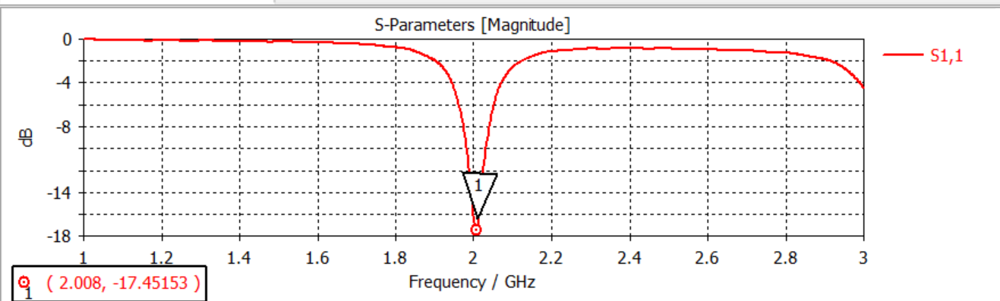
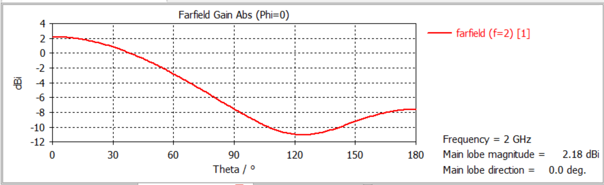
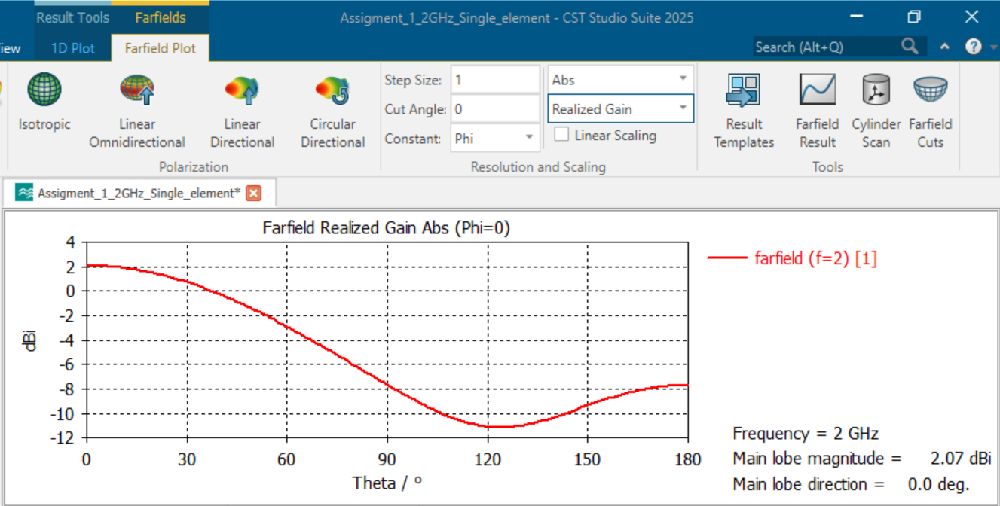
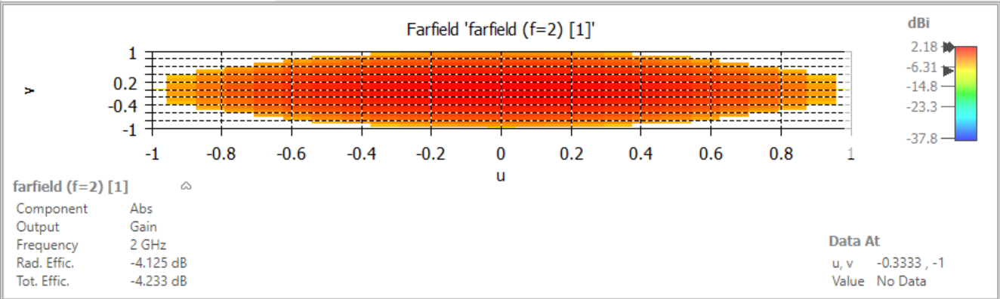
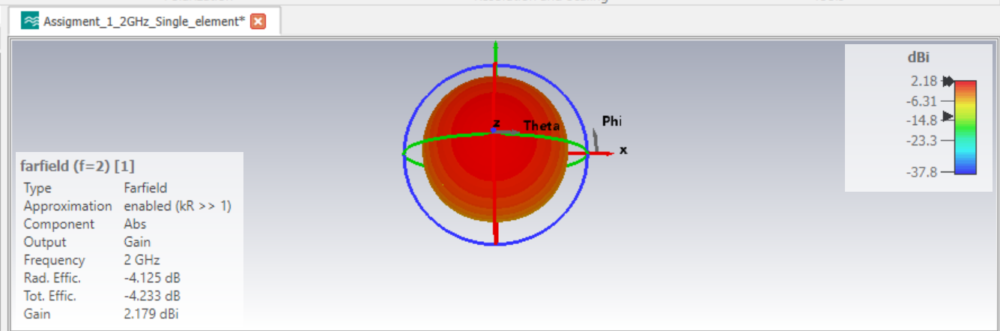
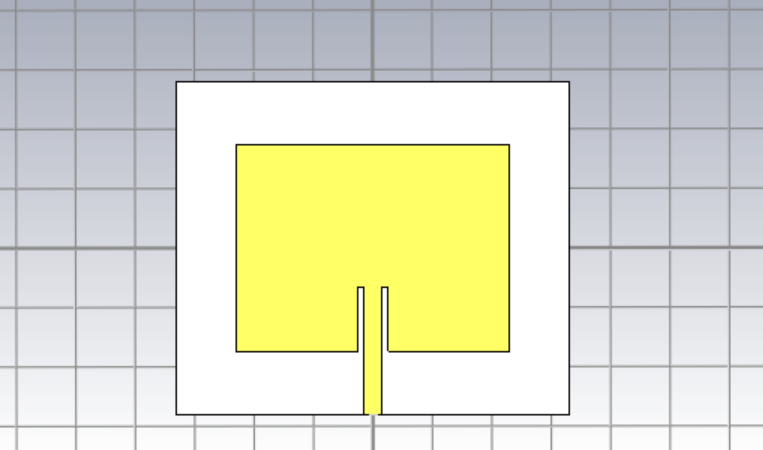

# 2 GHz Microstrip Patch Antenna (Inset-Fed)

Single-element inset-fed microstrip patch antenna designed and simulated
in CST Studio Suite 2025, resonant at 2 GHz on FR-4 substrate.

## Design Specifications

| Parameter | Value |
|---|---|
| Substrate | FR-4 (lossy) |
| Substrate size | 66 mm × 56 mm |
| Substrate height (h) | 1.6 mm |
| Copper thickness (t) | 0.035 mm |
| Patch dimensions (W × L) | 46.07 mm × 34.7 mm |
| Feed type | Inset-fed microstrip |
| Feedline width | 3.1 mm |
| Inset notch depth | 10.8 mm |
| Inset gap | 1 mm |
| Ground plane | Full substrate size (66 × 56 mm) |

See `docs/` for the CST geometry/parameter screenshots these values were taken from.

## Simulated Results

| Metric | Value |
|---|---|
| Resonant frequency | 2.006 GHz |
| Return loss (S11) | -17.48 dB |
| Gain (peak) | 2.18 dBi |
| Realized gain (peak) | 2.07 dBi |
| Radiation efficiency | -4.13 dB (~38.6%) |
| Total efficiency | -4.23 dB |
| Main lobe direction | 0° (broadside) |

## Results

### Return Loss (S11)


### Far-field Gain Pattern (1D, Gain)


### Far-field Realized Gain Pattern (1D)


### Far-field Gain Pattern (2D)


### Far-field Radiation Pattern (3D)


### Patch Geometry


## Discussion

The antenna achieves a strong impedance match (-17.48 dB return loss) at
the target 2 GHz frequency. Gain and efficiency are consistent with FR-4's
known dielectric loss tangent (~0.02) — a low-loss substrate such as
Rogers RT/duroid would be expected to improve realized gain by several dB
at the cost of higher material expense. The ~0.1 dB gap between gain
(2.18 dBi) and realized gain (2.07 dBi) reflects the small residual
mismatch loss from the -17.48 dB return loss.

## Repository Structure

```
2ghz-microstrip-patch-antenna/
├── design/     # CST Studio Suite project file
├── results/    # S-parameter and far-field result plots
└── docs/       # Geometry/parameter screenshots from CST (brick definitions, parameter list)
```

## Tools
- CST Studio Suite 2025

## Author
Habib Ur Rehman
